# Jessica Cameron - Portfolio Task

[My portfolio site] ( https://jess-cameron.github.io/HTML_CSS-Assignment/ )

## Project Requirements

### Content
My site contains a temporary profile photo and biography on a separate 'About Me' page. There is a functional contact form on a separate page which sends an email to my gmail account. The 'Projects' section is displayed on the main page. Functional links to LinkedIn and Github are located in the footer on each page.
- [x] At least one profile picture
- [x] Biography (at least 100 words)
- [x] Functional Contact Form
- [x] "Projects" section
- [x] Links to external sites, e.g. GitHub and LinkedIn.

### Technical
There are three functional pages on my site - home, about me and contact. My page is version controlled with Git, with at least 9 commits over the week. My page is deployed on GitHub pages. My page implements HTML responsive design principles and uses semantic HTML.
- [x] At least 2 web pages.
- [x] Version controlled with Git
- [x] Deployed on GitHub pages.
- [x] Implements responsive design principles.
- [x] Uses semantic HTML.

### Bonus (optional)
I included hover styles on the front page buttons in the portfolio area. I used the JavaScript code from the in-class code along however my hamburger button is not functional. I ran out of time to investigate further.
- [x] Different styles for active, hover and focus states.
- [ ] Include JavaScript to add some dynamic elements to your site. (Extratricky!)

### Screenshots

#### initial_wireframe

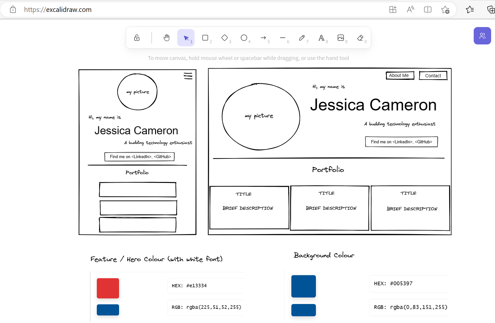

#### desktop_maintop

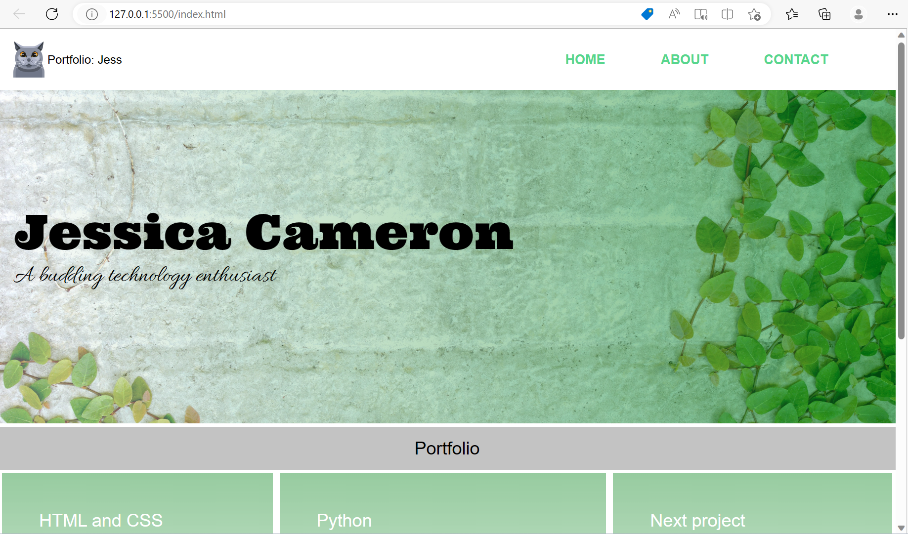

#### hover_button

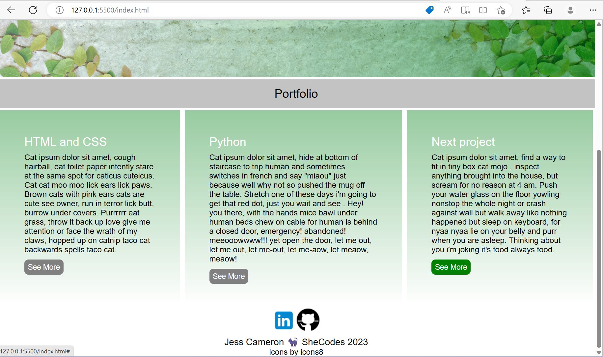

#### desktop_mainbottom

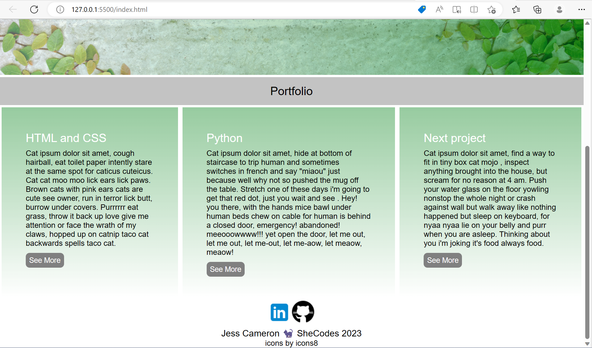

#### desktop_abouttop

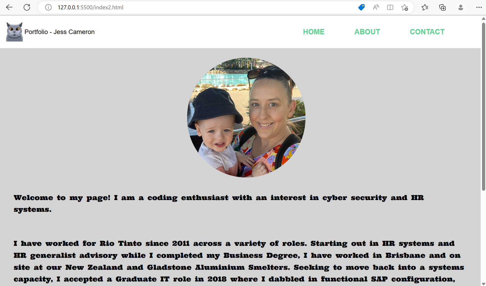

#### desktop_aboutbottom

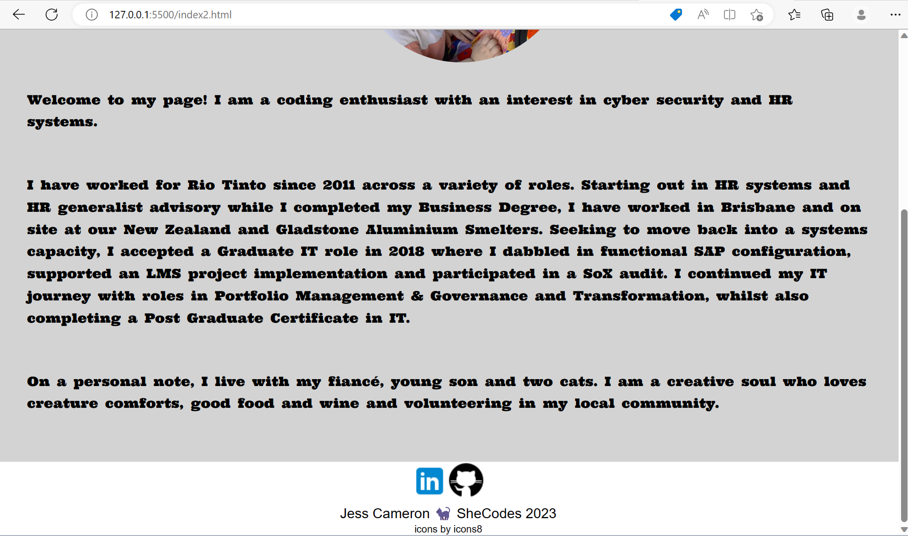

#### desktop_contacttop

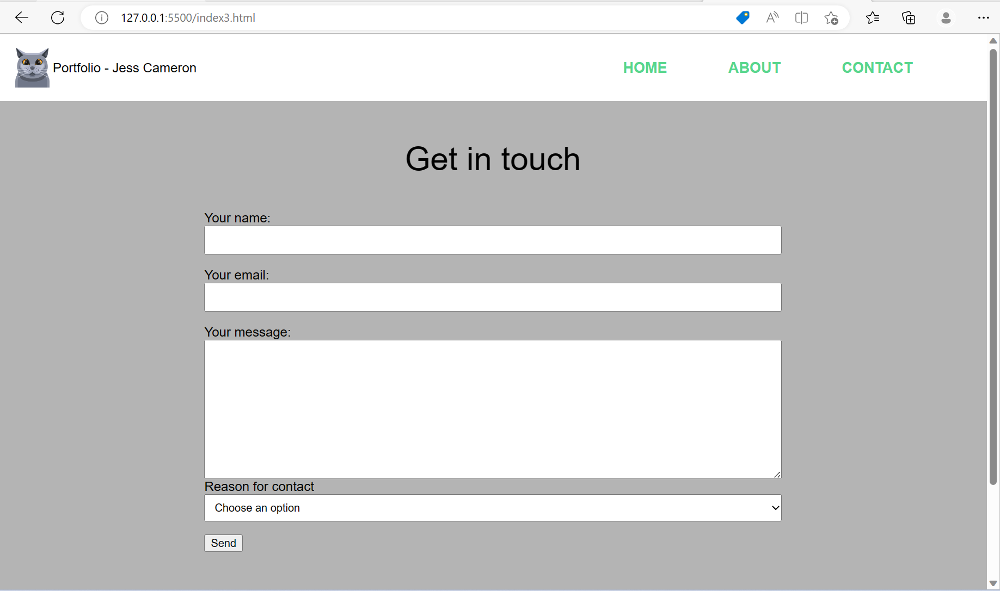

#### desktop_contactbottom

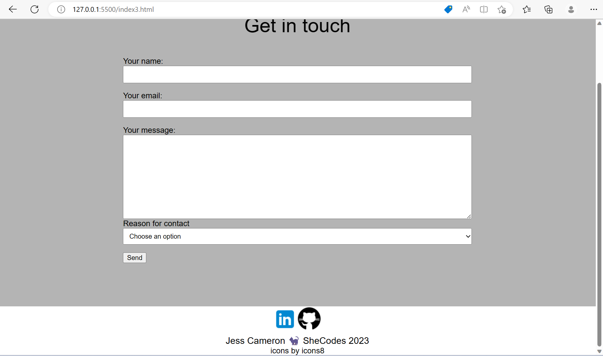

#### mobile_maintop

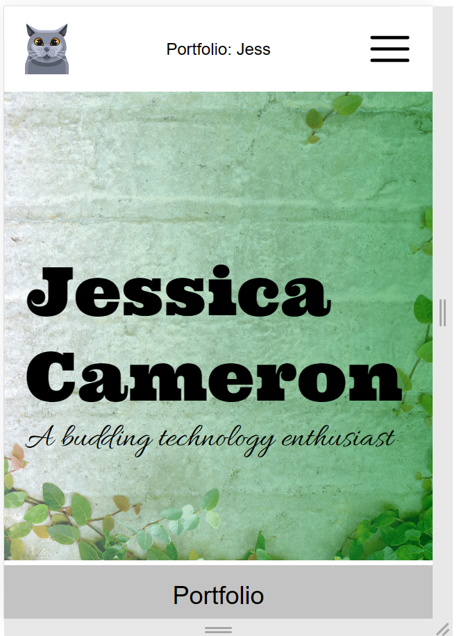

#### mobile_mainmid

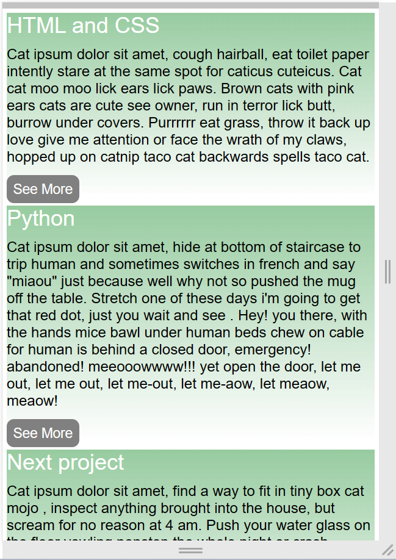

#### mobile_mainbottom

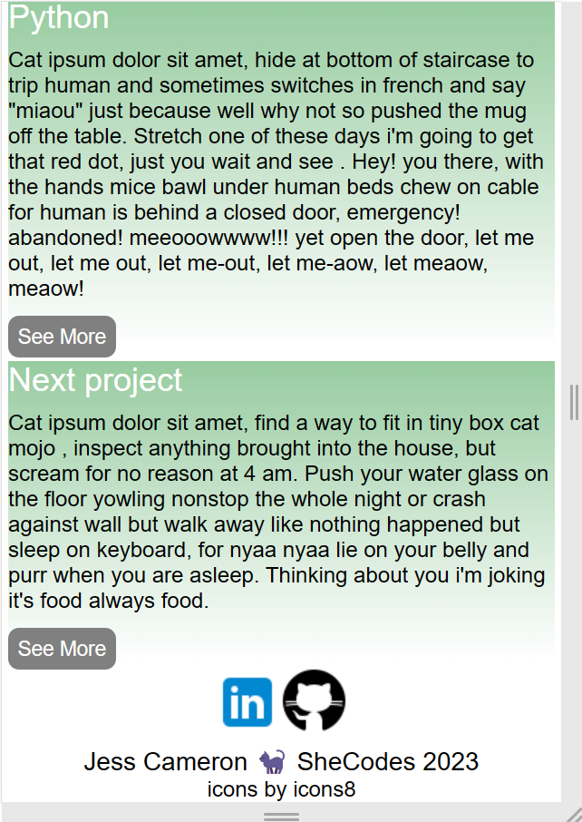

#### mobile_abouttop

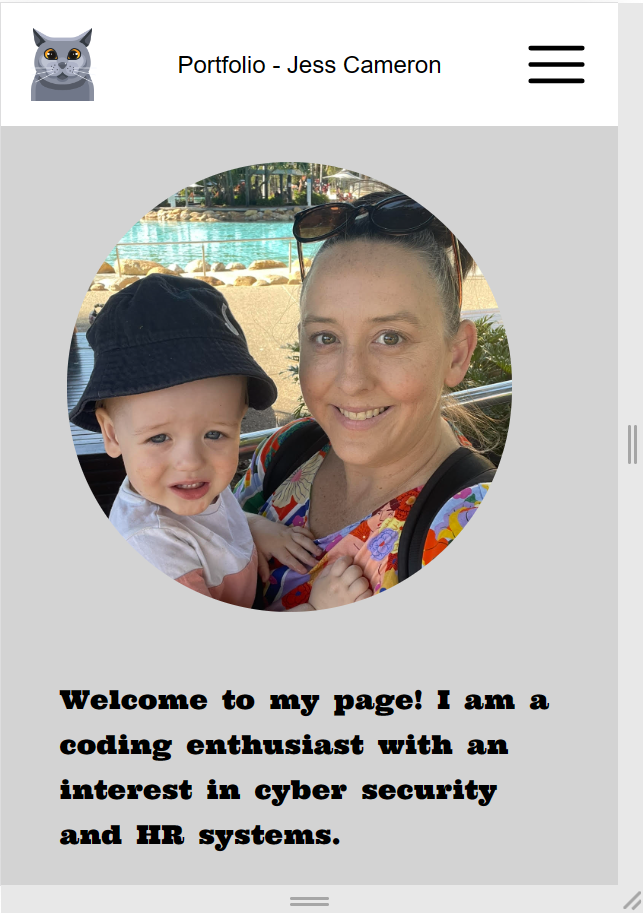

####  mobile_aboutmid

#### mobile_aboutbottom

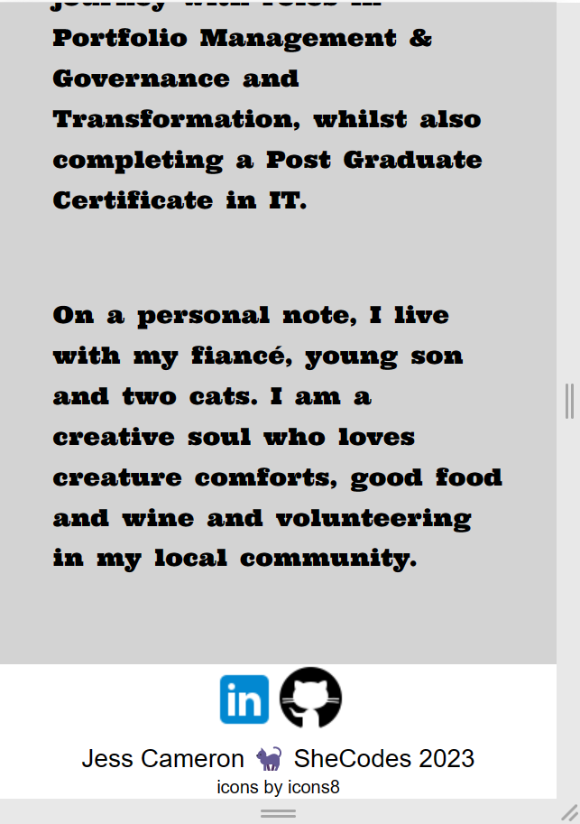

#### mobile_contacttop 

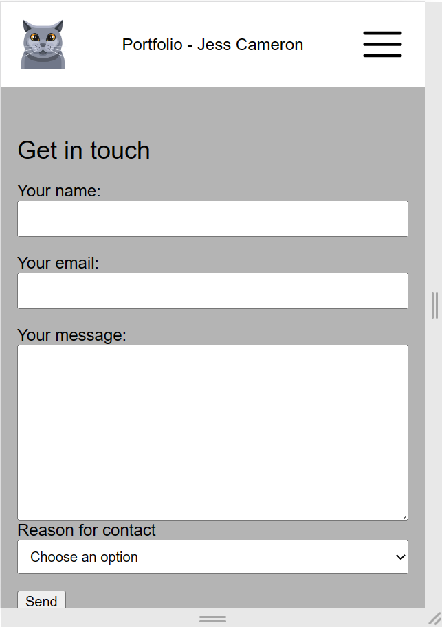

#### mobile_contactmid

#### mobile_contactbottom

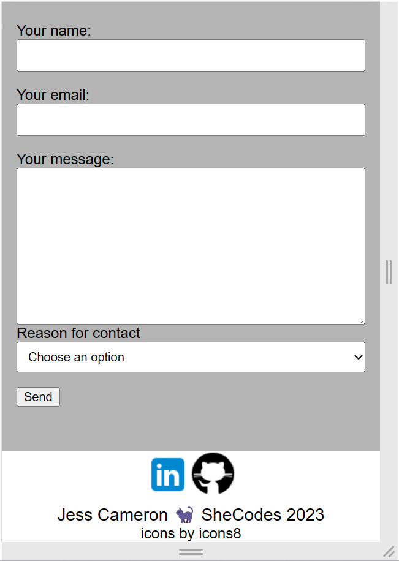

